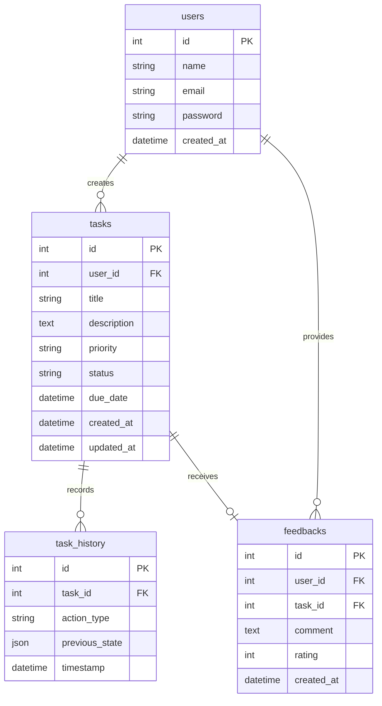

# Entity Relationship Diagram

## Relationships Explanation
1. **User (1) to (Many) Tasks**: A user can create many tasks. The `tasks.user_id` is a foreign key with `ON DELETE CASCADE` so tasks are removed if the user is deleted.
2. **User (1) to (Many) Feedbacks**: Users can leave multiple feedbacks. `ON DELETE CASCADE`.
3. **Task (1) to (Many) TaskHistory**: Every modification to a task logs an entry to the `task_history` table associating it to the specific task ID holding its previous state as a JSON object.
4. **Task (1) to (Zero Or One) Feedbacks**: Optional feedback provided to a task specifically. `ON DELETE SET NULL` protects the feedback metrics if a task is deleted.

## Indexing Decisions
- **`users.email`**: Indexed and unique for constant-time authentication lookup.
- **Foreign Keys**: `tasks.user_id`, `task_history.task_id`, `feedbacks.user_id` are natively indexed to optimize table joins which are necessary for cascading deletes and fetching dashboard data.
